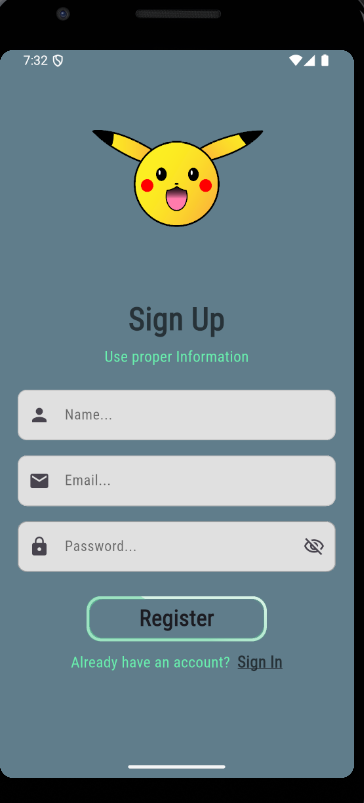

# Pokepedia App

A Pokédex-style application built to provide information about various Pokémon.

## Project Overview

This application serves as a comprehensive encyclopedia for Pokémon, allowing users to browse and discover details about different species. The core functionality includes a user interface to display Pokémon information and a user authentication system.

### Features

-   **Intuitive UI Design:** The user interface was custom-designed and implemented to provide a clean and engaging experience for users.
-   **User Authentication:** A logout feature is included in the top-left corner, sign up feature , login feature etc allowing authenticated users to securely sign in and sign out of the application.

## Technologies Used

-   **Dart/Flutter:** The primary language and framework used for development.
-   **Firebase:** Utilized for user authentication and managing the app's backend data.
-   **Git:** Version control for tracking project changes.

## Overview of My App

  
  &nbsp; &nbsp; &nbsp;
  
  &nbsp; &nbsp; &nbsp;
  
  &nbsp; &nbsp; &nbsp;
  
  &nbsp; &nbsp; &nbsp;
  

## My Contribution

I was responsible for the full implementation of the front-end user interface, following a personalized design approach. I also developed the logout functionality, which is a key part of the app's authentication flow.

## Contact

For any questions or feedback, please contact me at:

**Afsal Salim**
hiafsal63@gmail.com
